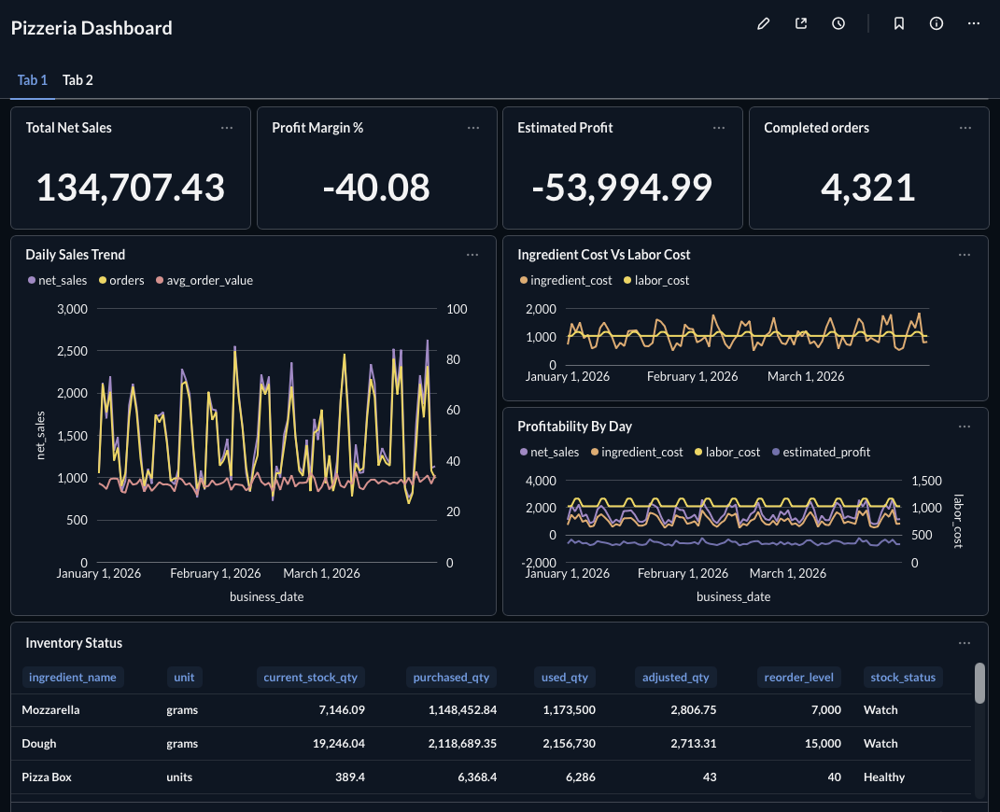
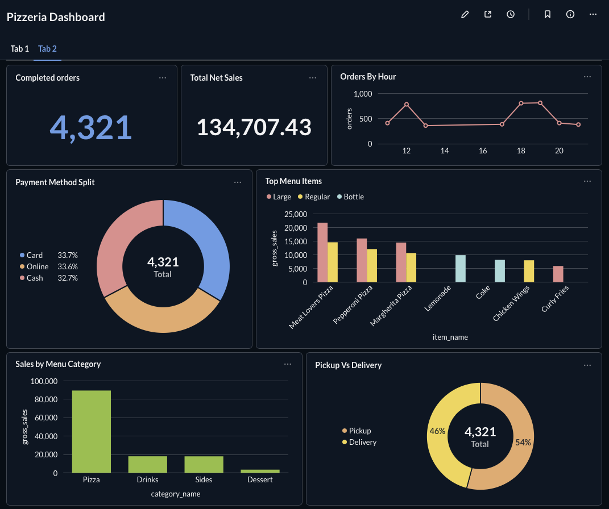

# Pizzeria Analytics Warehouse with DuckDB and Metabase

This project rebuilds the pizzeria dashboard idea with a free local stack:

- DuckDB as the analytical warehouse
- Python venv for repeatable local builds
- Synthetic pizzeria operations data
- SQL views for sales, inventory, purchases, staff, and profitability
- Metabase dashboards through the DuckDB Metabase driver
- ERD, data dictionary, and dashboard specification

## Dashboard Preview

### Tab 1: Executive, Profitability, and Inventory Overview



This tab gives an owner or operations manager a fast read on business health. The KPI cards show total net sales, estimated profit, profit margin, and completed orders. The trend charts compare sales, ingredient cost, labor cost, and estimated profit across the 90-day operating period. The inventory table highlights stock position, purchase quantity, usage quantity, adjustment quantity, reorder level, and current stock status.

Key observations from the generated dataset:

- Total net sales reached `134,707.43` across `4,321` completed orders.
- Estimated profit is negative at `-53,994.99`, with a profit margin of `-40.08%`.
- Ingredient and labor costs are high relative to revenue, which makes profitability the primary business concern.
- Dough and Mozzarella are in `Watch` status, meaning inventory planning needs attention before the next purchase cycle.

### Tab 2: Sales Behavior and Demand Patterns



This tab focuses on how customers order and which products drive sales. It includes completed orders, net sales, hourly demand, payment method split, top menu items, sales by menu category, and pickup versus delivery mix.

Key observations from the generated dataset:

- Completed orders total `4,321`.
- Pizza is the dominant revenue category, far ahead of drinks, sides, and dessert.
- Top-selling products include Meat Lovers Pizza, Pepperoni Pizza, and Margherita Pizza.
- Payment method usage is balanced across card, online, and cash.
- Pickup and delivery are close, with pickup slightly higher at about `54%`.

## Architecture

```text
Python synthetic data generator
        |
        v
CSV files in data/raw
        |
        v
DuckDB warehouse in data/warehouse/pizzeria.duckdb
        |
        v
SQL analytical views
        |
        v
Metabase dashboards
```

## Requirements

- Python 3.10 or newer
- Docker only if you want to run Metabase locally

If your system Python is too new for some packages, use Python 3.12:

```bash
python3.12 -m venv .venv
```

## Quick Start

From this folder:

```bash
python3 -m venv .venv
source .venv/bin/activate
python -m pip install --upgrade pip
python -m pip install -r requirements.txt
python scripts/run_pipeline.py
```

Or use Make:

```bash
make setup
make run
```

The final DuckDB database will be created at:

```text
data/warehouse/pizzeria.duckdb
```

## Run Metabase

Metabase requires Docker. Once Docker is installed:

```bash
cd metabase
docker compose up --build
```

Open:

```text
http://localhost:3000
```

When adding the database in Metabase:

- Database type: `DuckDB`
- Database file path: `/data/warehouse/pizzeria.duckdb`

If you do not see `DuckDB` as a database type, the DuckDB driver did not load. Rebuild the Metabase image:

```bash
docker compose build --no-cache
docker compose up
```

## What The Data Represents

The dataset is synthetic, but modeled like a real pizzeria operation:

- Orders and order line items
- Customers and delivery addresses
- Menu items, categories, and sizes
- Ingredients and recipes
- Ingredient purchases from vendors
- Inventory usage and stock status
- Staff members and shift rotations
- Daily profitability

## Main Analytical Views

- `vw_sales_data`
- `vw_daily_sales`
- `vw_hourly_orders`
- `vw_inventory_in`
- `vw_inventory_out`
- `vw_inventory_status`
- `vw_ingredient_usage`
- `vw_purchases_data`
- `vw_staff_data`
- `vw_profitability`
- `vw_low_stock_alerts`

## Suggested Dashboard Tabs

1. Operations overview
2. Sales and order behavior
3. Inventory and low-stock alerts
4. Ingredient cost and purchasing
5. Staff shifts and labor cost
6. Profitability

See [Dashboard Spec](docs/dashboard_spec.md) for chart-by-chart guidance.

## Business Requirements Document

The project BRD is available here:

[Business Requirements Document](docs/business_requirements_document.md)

## Project Structure

```text
pizzeria-duckdb-metabase/
  data/
    raw/
    warehouse/
    exports/
  docs/
    business_requirements_document.md
    erd.md
    data_dictionary.md
    dashboard_spec.md
    pipeline.md
  assets/
    screenshots/
      metabase-dashboard-overview.png
      metabase-dashboard-sales.png
  metabase/
    Dockerfile
    docker-compose.yml
  scripts/
    generate_data.py
    build_warehouse.py
    validate_warehouse.py
    run_pipeline.py
  sql/
    01_schema.sql
    03_views.sql
    04_dashboard_queries.sql
```


