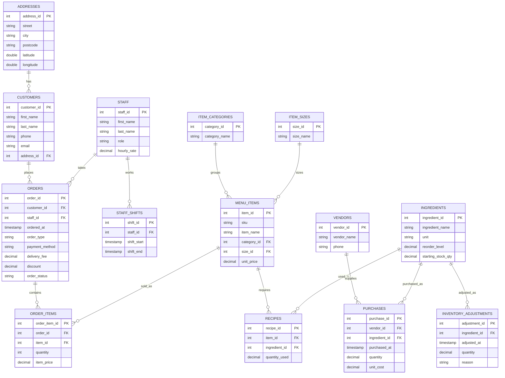

# ERD

```mermaid
erDiagram
    ADDRESSES ||--o{ CUSTOMERS : has
    CUSTOMERS ||--o{ ORDERS : places
    STAFF ||--o{ ORDERS : takes
    STAFF ||--o{ STAFF_SHIFTS : works
    ORDERS ||--o{ ORDER_ITEMS : contains
    MENU_ITEMS ||--o{ ORDER_ITEMS : sold_as
    ITEM_CATEGORIES ||--o{ MENU_ITEMS : groups
    ITEM_SIZES ||--o{ MENU_ITEMS : sizes
    MENU_ITEMS ||--o{ RECIPES : requires
    INGREDIENTS ||--o{ RECIPES : used_in
    VENDORS ||--o{ PURCHASES : supplies
    INGREDIENTS ||--o{ PURCHASES : purchased_as
    INGREDIENTS ||--o{ INVENTORY_ADJUSTMENTS : adjusted_as

    ADDRESSES {
        int address_id PK
        string street
        string city
        string postcode
        double latitude
        double longitude
    }

    CUSTOMERS {
        int customer_id PK
        string first_name
        string last_name
        string phone
        string email
        int address_id FK
    }

    STAFF {
        int staff_id PK
        string first_name
        string last_name
        string role
        decimal hourly_rate
    }

    STAFF_SHIFTS {
        int shift_id PK
        int staff_id FK
        timestamp shift_start
        timestamp shift_end
    }

    ORDERS {
        int order_id PK
        int customer_id FK
        int staff_id FK
        timestamp ordered_at
        string order_type
        string payment_method
        decimal delivery_fee
        decimal discount
        string order_status
    }

    ORDER_ITEMS {
        int order_item_id PK
        int order_id FK
        int item_id FK
        int quantity
        decimal item_price
    }

    MENU_ITEMS {
        int item_id PK
        string sku
        string item_name
        int category_id FK
        int size_id FK
        decimal unit_price
    }

    ITEM_CATEGORIES {
        int category_id PK
        string category_name
    }

    ITEM_SIZES {
        int size_id PK
        string size_name
    }

    INGREDIENTS {
        int ingredient_id PK
        string ingredient_name
        string unit
        decimal reorder_level
        decimal starting_stock_qty
    }

    RECIPES {
        int recipe_id PK
        int item_id FK
        int ingredient_id FK
        decimal quantity_used
    }

    VENDORS {
        int vendor_id PK
        string vendor_name
        string phone
    }

    PURCHASES {
        int purchase_id PK
        int vendor_id FK
        int ingredient_id FK
        timestamp purchased_at
        decimal quantity
        decimal unit_cost
    }

    INVENTORY_ADJUSTMENTS {
        int adjustment_id PK
        int ingredient_id FK
        timestamp adjusted_at
        decimal quantity
        string reason
    }
```

