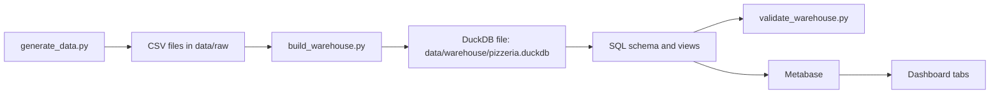

# Pipeline

## Build Steps

1. `generate_data.py` creates deterministic synthetic operational data.
2. `build_warehouse.py` creates a fresh DuckDB database and loads the CSV files.
3. `03_views.sql` creates dashboard-ready analytical views.
4. `validate_warehouse.py` checks row counts, data quality rules, and sample outputs.
5. Metabase reads the DuckDB file through the DuckDB driver.

## Why DuckDB Works Here

DuckDB is a good fit because this project is an analytical workload. The source data is generated in batches, loaded into a local warehouse file, and queried through SQL views. This avoids the concurrency problems that can happen when multiple processes write to the same embedded database file.

